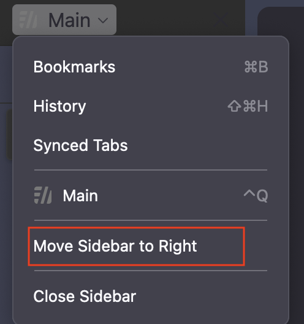

# Preview

https://github.com/theiha/firefox-config/assets/152792316/5303c21e-a419-424d-8965-5ca08a91ec99

## Installation Guide

### 1. Install Firefox

Make sure to have [Firefox](https://www.mozilla.org/firefox/new/) installed.

### 2. Access Firefox Profiles

- Open Firefox and navigate to `about:profiles`
  - Find and open the root directory of your profile
- Open Firefox and navigate to `about:config`
  - Set `toolkit.legacyUserProfileCustomizations.stylesheets` to `true`

### 3. Add Custom Files

- Choose either `userChrome_v1` or `userChrome_v2` in the `chrome` folder (the v2 enables a smooth animation for the auto-hidden sidebar).
- Be sure to rename the file you chose to `userChrome.css`.
- Add the `chrome` folder to the `.default-release` folder in the root directory.

### 4. Install Sidebery

- Make sure to have [Sidebery](https://addons.mozilla.org/firefox/addon/sidebery/) added as an extension for Firefox.

### 5. Configure Sidebery

- Go to Sidebery's settings.
- In the styles editor, add the contents of `sidebery.css` to the CSS option.

## FAQ

### Firefox does not look like it does in the video

Unfortunately Firefox made some adjustments, which in turn broke this theme. While I am trying to fix this you can use userChrome_v3, which should provide a usable experience.

### How do the different css files differ?

- userChrome_v1 (legacy)
  - nav bar does not auto hide
- userChrome_v2 (legacy)
  - nav bar does auto hide
- userChrome_v3
  - url bar and is always present
  - forward and backward arrows are always present
  - sidebar does not include recently closed tab, bookmarks and the tab history
  - the browser content box does not have rounded corners
- userChrome_sidebar_fixed
  - sidebar now includes recently closed tab, bookmarks and the tab history again
- userChrome_fixed
  - the browser content box has rounded corners again
- userChrome_fixed_color
  - grey colored UI elements (background, url/nav-bar, sidebar)
    - sidebar needs changes in `sideberry.css` -> `--frame-bg: <your_color_here> !important; /* this is the sidebar background color */`
  - auto hiding top bar
    - does not auto show, needs to be opened with a shortcut
- userChrome_fixed_color_hiding
  - `userChrome_fixed_color`, but the sidebar is now fully hidden

### I want to move the sidebar to the right

Steps:

1. Change this:
   ```css
   #sidebar-header {
     display: none;
     color: var(--background-color);
   }
   ```
2. To this:
   ```css
   #sidebar-header {
     display: visible;
     color: var(--background-color);
   }
   ```
3. Move the bar to the side you desire:
   <div style="text-align: center;">
       
   </div>
