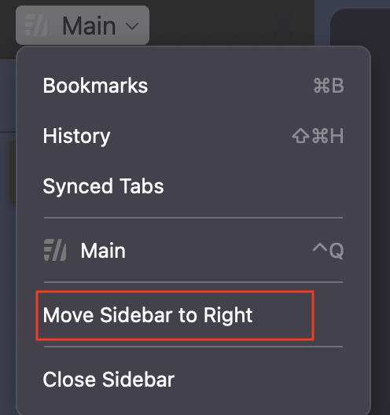

# Firefox + Sidebery

[Preview (Older colors)](https://github.com/theiha/firefox-config/assets/152792316/5303c21e-a419-424d-8965-5ca08a91ec99)

## Install

1. In `about:profiles`, open the active profile's **Root Directory**.
2. In `about:config`, enable `toolkit.legacyUserProfileCustomizations.stylesheets`.
3. Copy `userChrome.css` to `<profile>/chrome/userChrome.css`.
4. Install [Sidebery](https://addons.mozilla.org/firefox/addon/sidebery/).
5. Paste `sideberry.css` into Sidebery's Styles editor. Set `--frame-bg` to `#2b2b2b`.
6. Restart Firefox.

## Customize

Edit the variables at the top of `userChrome.css`:

- `--background-color`: window and sidebar background
- `--field-color`: search field background
- `--text-color`: chrome text
- `--navbar-height`: navigation height and hidden offset
- `--sidebar-expanded-width`: sidebar width on hover

## Sidebery
How to change the location of Sidebery

1. Change this:
   ```css
   #sidebar-header {
     display: none;
     color: var(--background-color);
   }
   ```
2. To this:
   ```css
   #sidebar-header {
     display: visible;
     color: var(--background-color);
   }
   ```
3. Move the bar to the side you desire:
   <div style="text-align: center;">
       
   </div>
